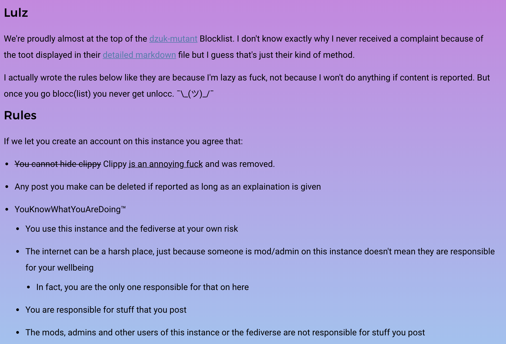
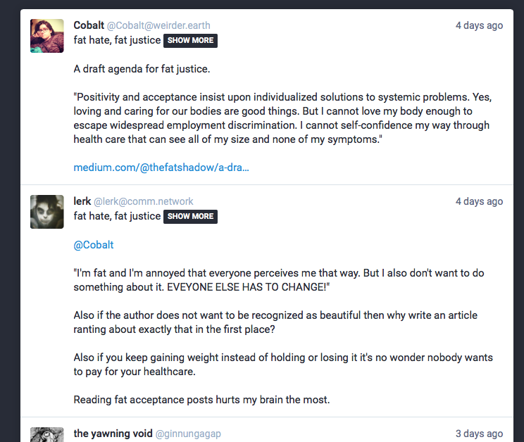

# comm.network

***last updated 2018.08.23***

(https://comm.network/about/more)

- Very nice 'we are not responsible for your own safety but yourself' rhetoric, because *everybody* knows that all instances of abuse are self-inflicted. 😒
    - Nah, I meant that if you decide to troll feminazis it's your fault for getting shitstormed.

- The admin (unsurprisingly) has made some pretty shitty and abusive toots of their own.
    - Of course, why should I defend such stupidity as saying being fat is healthy?

(https://comm.network/@lerk/100349020301034703)

(https://mastodon.social/@ginnungagap/100349797587910177)

- (thread viewed from mastodon.social because the theming seems broken on comm.network)
   - No it's meant to look like this.
