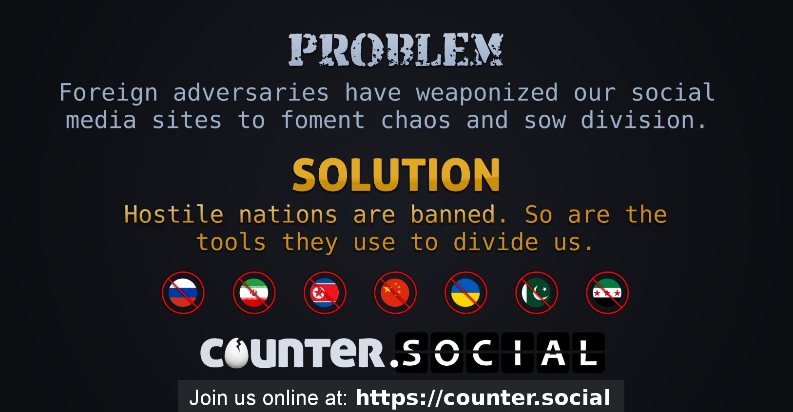
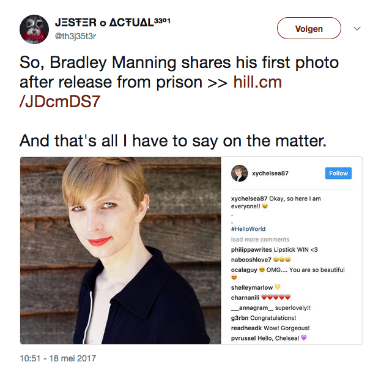

# counter.social

***last updated 2018.06.13***

The main premise of counter.social is a jingoist statement in response to investigations related to social media advertising being used by foreign states to attempt to influence the 2016 US General Election. 

This instance blocks entire countries' populations (ie. Russia, Iran, China, Ukraine etc.) based solely on their governments' (or part of their government, as is the case with Ukraine) relationships with the United States government. They block VPN exits too out of fear that those governments may use them for social media campaigns.

The basis for this instance is very generalising and applies an ugly (and ironically divisionary) worldview. It completely ignores the fact that people in a country can often have differing political opinions to that of the ruling political party, the idea of political dissidents and the idea that anyone can basically... influence anyone, like friends, neighbours, corporations, social media networks, political parties in your country, and basically anyone with the same passport (or not) as you.

This also doesn't tackle the supposed problem like they think it does at all (a government can just set up base in another country or pay people in other countries to do the work for them), and it hurts people in the west (like myself) who use VPNs to evade government and corporate surveillance in their own countries, which they seem to be just fine with.

All-round, it should be a joke because of how poorly thought out it is, but it isn't, and it's pretty shitty to begin with.

(https://twitter.com/th3j35t3r/status/865263475819507712)

It also turns out that the admin has some anti-trans sentiment and insists on misgendering trans people (one example (screencapped above) I have been told by multiple sources there are other examples).

