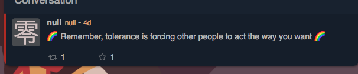
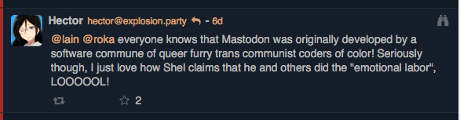
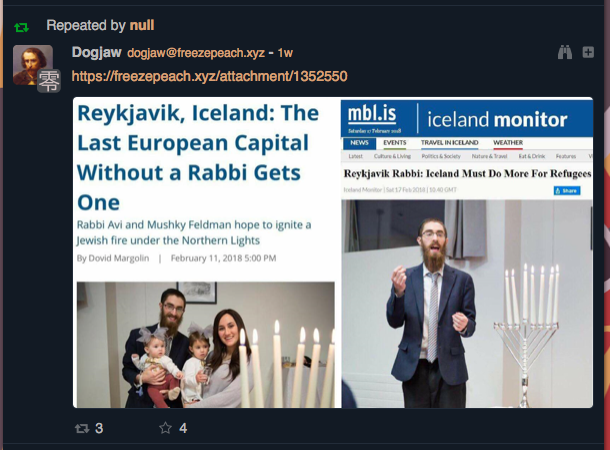
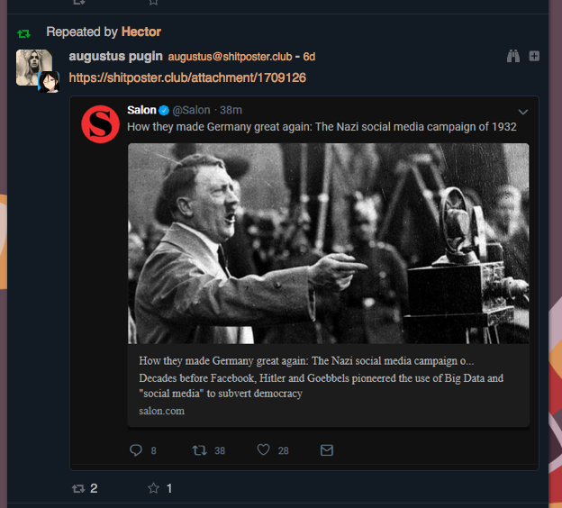

# explosion.party

***last updated 2018.07.04***

Multiple people on the instance, including the admin (@hector), have been posting alt-right and anti-semitic memes and content.

### example 1

(https://explosion.party/notice/66323)

### example 2

(https://explosion.party/notice/40333)

Intentional misgendering of a Mastodon user.

### example 3

(URL not attainable because it was a boost)

Using the two articles to imply a common alt-right anti-semitic conspiracy theory that Jews are erasing 'white identity' by encouraging non-white migration (into what they perceive as white countries like those in Europe), among other things.

### example 4

(URL not attainable because it was a boost)
