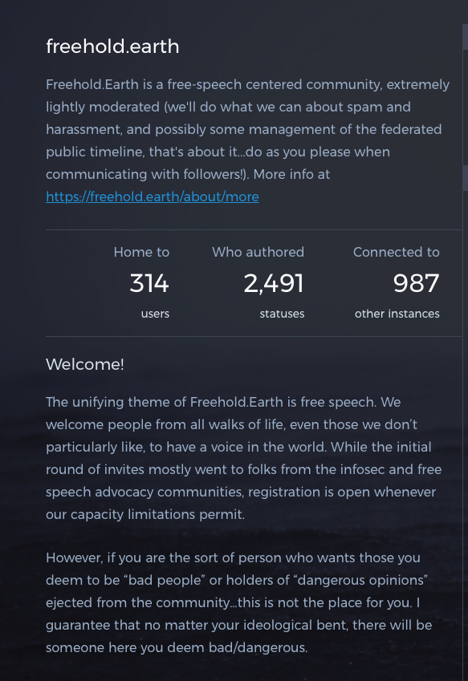
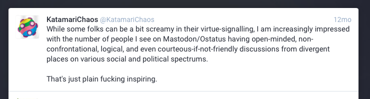
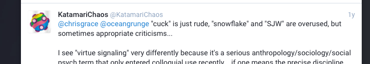
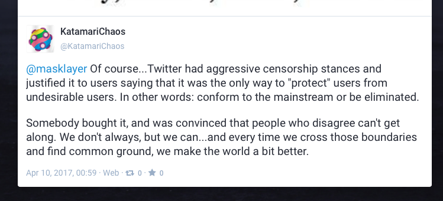
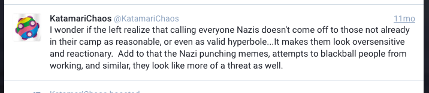

# freehold.earth

***last updated 2018.07.12***

***Admin user accounts haven't been updated in a year since writing this, but I'm gonna name it and shame it anyway because it's still online at the time of writing.***

Another one of those instances that uses 'free speech' as a scapegoat.

(https://freehold.earth/about/more)

It's written friendly enough, but if you're familiar enough with the shit on this list then you know it means exactly what it means (especially in the context of ""dangerous opinions"") - no hate speech moderation.

(https://freehold.earth/@KatamariChaos/4132)

The façade of neutrality quickly strips away when you find that the most active local admin of the instance (@KatamariChaos) has been found to use the term 'virtue signalling' - a buzzword that's a staple of neo-reactionaries. While they say they aren't coming from an alt-right perspective in the same thread as when they said that word, other posts from the admin indicate a flawed perspective of speech and social groups indicative of this kind of moderation practice (and there are plenty more than the ones I have included here).

(https://freehold.earth/@KatamariChaos/13154)

(https://freehold.earth/@KatamariChaos/7381)

(https://freehold.earth/@KatamariChaos/265258)

*'We can find a common ground... EXCEPT THE OVERSENSITIVE LEFTISTS WHO JUST WANT TO TALK ABOUT NATZEES'* (Also notice the distinction between how the connotations of who the 'dangerous people' are in the rules is different to the 'threat' mentioned here).

Like with anyone who presents themselves to have something approximating neutral position, or a position that is compatible with everyone (spoiler: that is impossible), they always have some kind of bias, and this is only a theatrical form of avoidance (and they tend to slip that bias out one way or another).

Also yeah, the instance has pretty clearly indicated that hate speech is not something they really give a shit about.