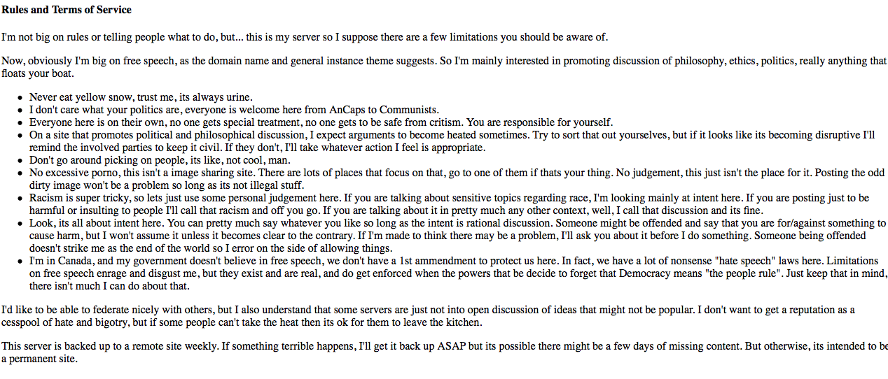
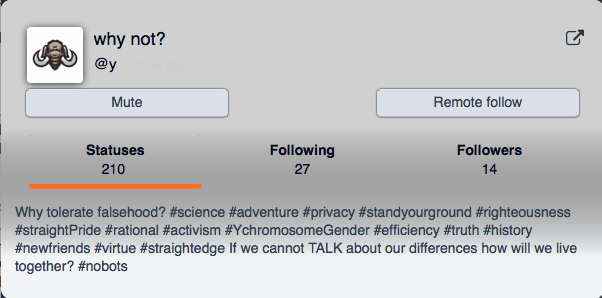
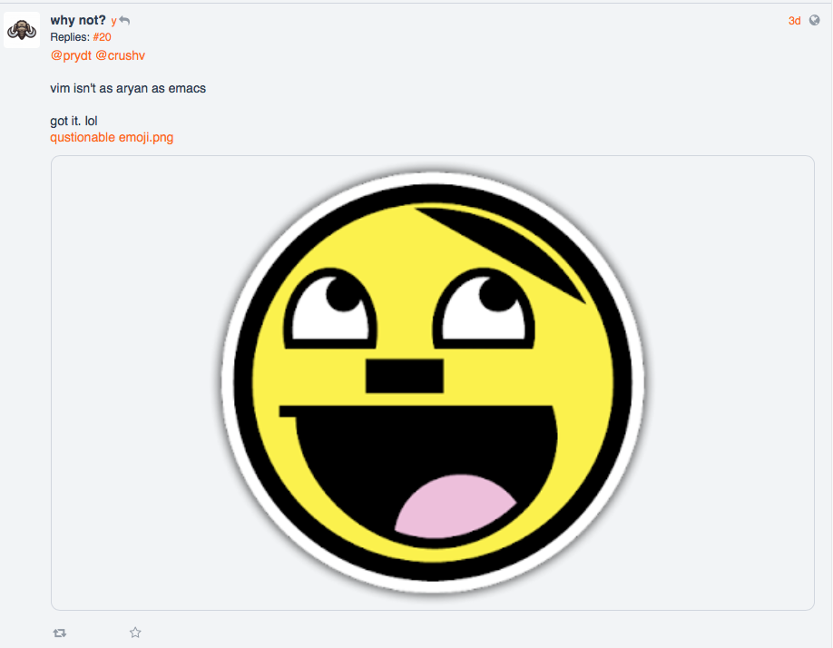
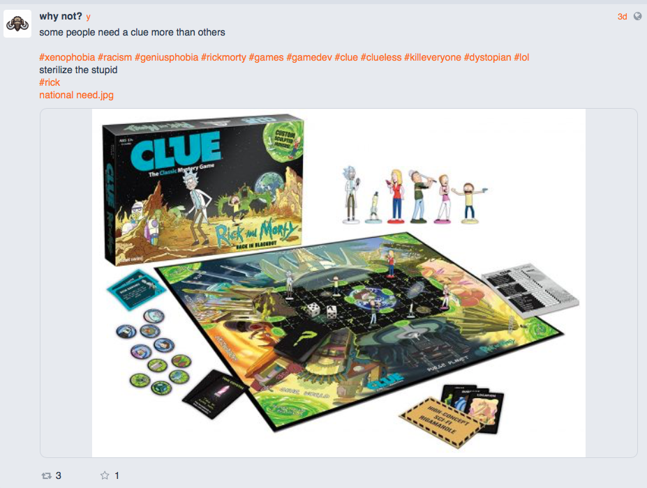
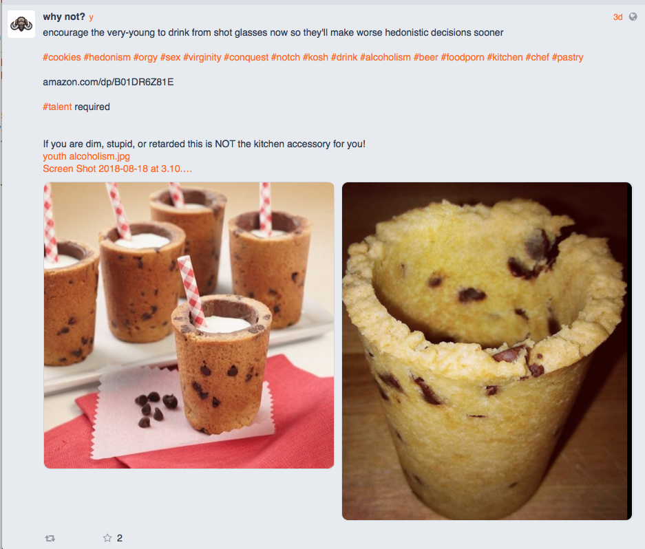

# freespeech.host

***last updated 2018.08.21***

The instance's administration has made it clear that they aren't particularly interested in moderating hate speech and the instance already has a user with pretty fashy tendencies.

(https://freespeech.host/static/terms-of-service.html)

The usual 'I'm not responsible for your safety' and 'ehhh, politics are just all ideas' psuedo-intellectual thing that exists in various other instances on this list.

---

One of their users, @y, has a profile bio containing a wide collection of dogwhistles, is posting psuedo-ironic Nazi memes, has a thing with hedonism, orgies and sterilisation (along with the other things this user has said, indicates some pretty fashy tendencies).

(https://freespeech.host/users/6003)

Listing the major dogwhistle hashtags:

- `#straightPride` = the thing that homophobes use when they're upset about pride month
- `#YchromosomeGender` = chromosomes determine gender (a scientifically incorrect gesture aimed at de-legitimising trans people)

The others (especially when you look at the other bits this user has posted) indicate far-right tendencies that emphasises whatever they believe 'virtue' is and that they stand firm against degeneracy and unreasonable queers and bla bla bla.

Yes, I'm sure that you're open to and are going to attract all the opinions with a bio like that. (Notice how they delineate a regressive and inaccurate worldview and then frame it so it looks like they are the adventurous and reasonable one.)

(https://freespeech.host/notice/191102)

(https://freespeech.host/notice/192166)

(https://freespeech.host/notice/192317)

DEFEND YOUR KIDS FROM THE COOKIE ORGY AGENDA