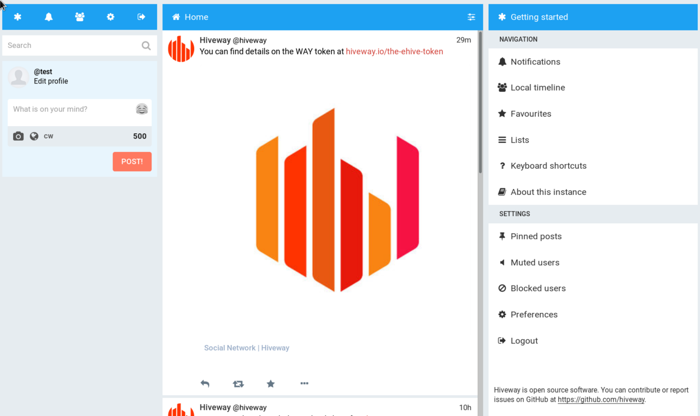
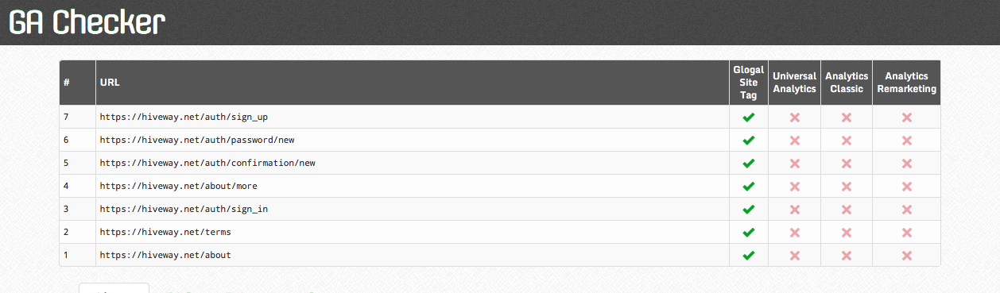

# hiveway.io

***last updated 2018.06.20***

***This instance is dead and there is no reason to expect it to come back. The information on this instance however has been archived for historical purposes.***

***The following information is outdated and written as if it was still active (sometime in early 2018).***

- This is Mastodon with the serial numbers filed off (they removed nearly all mention of it being a Mastodon fork, breaking Mastodon's [AGPL3 license](https://www.gnu.org/licenses/agpl-3.0.html)).
- They have added Google Analytics trackers (which track it's users activity  not the content that is posted or is federated to it)
- It has an ICO slapped on.
- [Their CoC](https://hiveway.net/about/more) just states 'Please do not post offensive or inappropriate content'. Really not adequate. 
- [They plan on selling ad space on their instance](https://www.hiveway.io/what-is-hiveway), potentially polluting the fediverse with corporate advertising.

Advertising, tracking, ICO, corporate BS or just all-round sleaziness, take your pick of what things you want to block it for. It really sucks.

*Hiveway's use of Google Analytics to track it's users (via http://www.gachecker.com)*