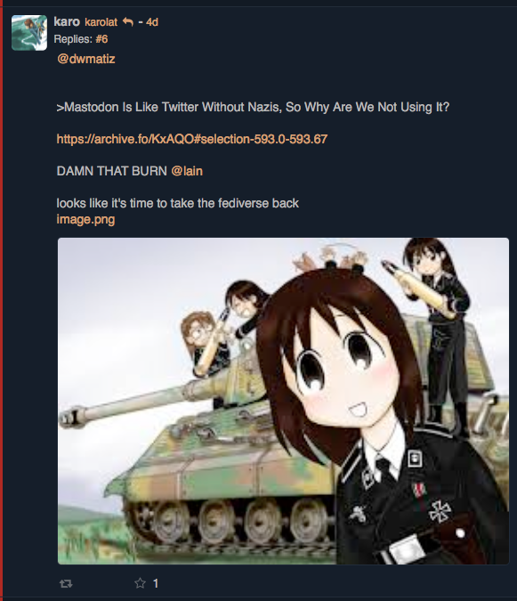
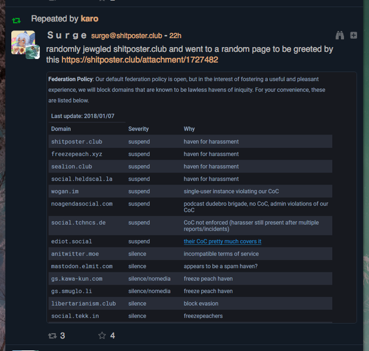

# kawaiistu.moe

***last updated 2018.07.12***

***This instance no longer exists. It has been replaced with (and redirects to) [karolat.press](../karolat_press/karolat_press.md).***

This instance's admin (@karolat) has a history of boosting and posting content with neo-Nazi and alt-right content and dogwhistles.

### example 1

(https://kawaiistu.moe/notice/1582823)

(anime girls wearing Nazi military uniforms)

### example 2

(https://kawaiistu.moe/notice/1640831)

This boosted post contains 'jewgled' - a portmanteau of 'jew' and 'google' - an antisemitic insinuation that jews control the major social media and technology platforms.