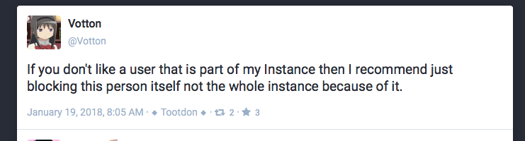

# kyot.me

***last updated 2018.07.13***

***This instance appears to no longer exist as an ActivityPub instance. This file is currently being kept for future reference.***

(https://kyot.me/@Votton/99375458241382288)

This attitude on behalf of an admin (@Votton) is typical of an administration philosophy of this nature. 

Hate speech is reduced to something some people simply 'don't like' and that every federation issue is simply resolvable through individual blocking despite that not actually being how harassment and abuse tactics work in the real world.