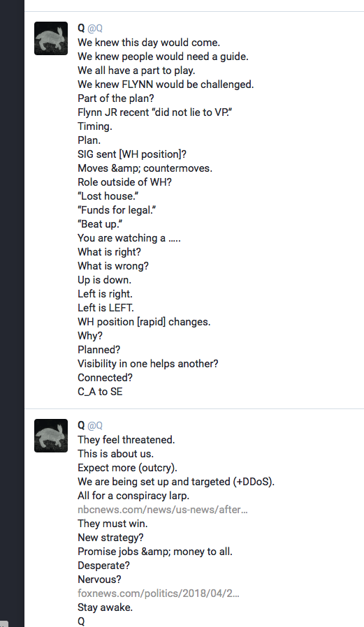
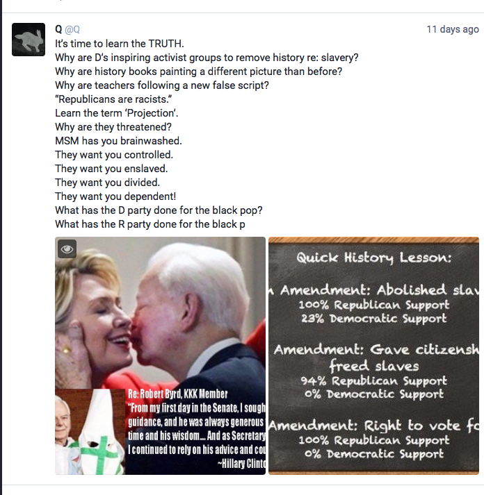
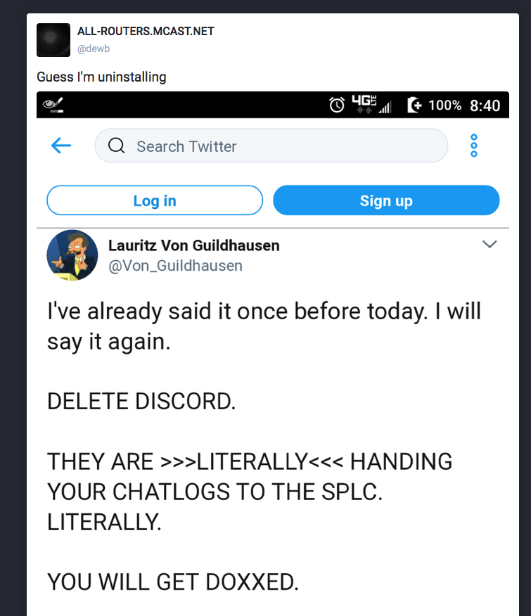
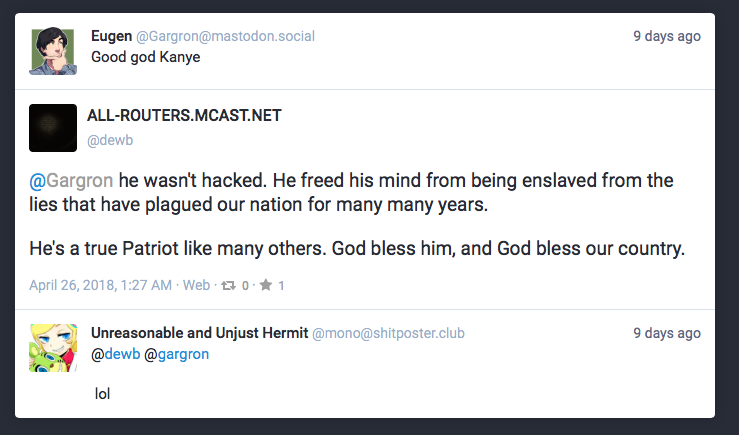
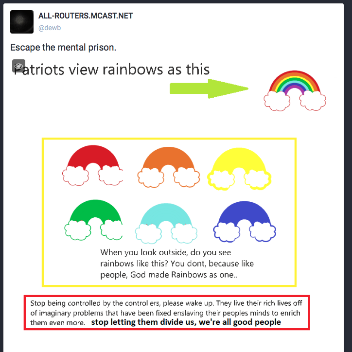

# not.phrack.fyi

***last updated 2018.06.13***

The main reason you would want to block this instance is that the admin actively promotes a bunch of Trump-flavoured conspiracy theories, at least some of which are known as QAnon. Think of QAnon as Pizzagate on steroids (which incidentally, is also a part of QAnon beliefs). 

Another one of his users, @Q, is a bot mirror for qanon.pub, which is a weird 'intelligence hub' (if you can realistically call it that) for QAnon followers. It mainly seems to pump out unintelligible details along with some alt-light memes and rhetoric thrown in with even more of a conspiracy theory sheen than normal.

[Here's an explainer on QAnon](https://medium.com/@willsommer/meet-the-storm-the-conspiracy-theory-taking-over-the-pro-trump-internet-3ec94bf7d8a3), you can also check the #qanon hashtag on Twitter or /r/greatawakening ([or the kinds of things people post when they link to qanon.pub](https://www.reddit.com/domain/qanon.pub/)) on Reddit at your own peril.

## Examples

#### Example 1

#### Example 2

(https://not.phrack.fyi/@Q/99911369922925505)

#### Example 3

(https://not.phrack.fyi/@dewb/99886152496512588)

@Von_Guildhausen is some alt-right Twitter user. This is also more conspiracy theory nonsense. Discord does not have a policy that would enable them to hand personal user data over to a non-governmental organisation for this purpose.

As with other internet services, the only thing Discord has done in response to white nationalists is [close down accounts and servers](https://www.theverge.com/2017/8/14/16145432/discord-nazi-ban-white-supremacist-altright).

(Also if you're scared of the [SPLC](https://splcenter.org), a highly reputable anti-hate group organisation, that's really not a great sign.)

#### Example 4

(https://not.phrack.fyi/@dewb/99922899393664988)

#### Example 5

(https://not.phrack.fyi/@dewb/99915837792430454)