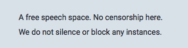
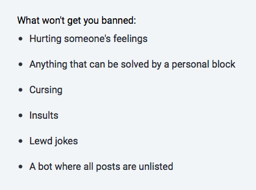

# qoto.org

***last updated 2018.07.11***

An instance whose rules either implicitly or explicitly make it clear that various kinds of abuse and hate speech will be allowed.

The admin of the instance is also engaged in some pretty unpleasant/shitty shitposting.

### rules

(both pics are from: https://qoto.org/about/more)

This means that essentially, 'we aren't going to do anything about hate speech'.

Ohhh boy.

### example 1

(https://qoto.org/@freemo/100357461569095586)

(this is from the admin)

