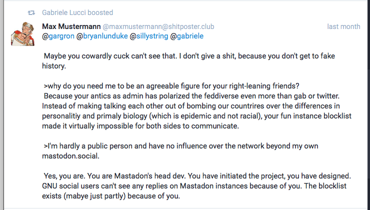
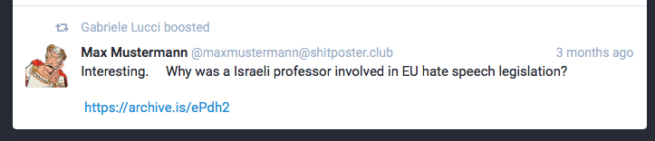

# social.lucci.xyz

This user as of existing research has not posted anything of the kind shown in the examples themselves, but still promotes them themselves, and seens to knowingly, given the ideological consistency (typically indicative of the so-called Alt-Right) between them.

### example 1

This user has boosted an essentially racialist post ('over the differences in personality and primary biology (which is epidemic and not racial)'). 

Also let's not forget the use of 'cuck'. 🙄

### example 2

They have also boosted another post making an anti-semitic insinuation. (That a Jew was involved in EU hate legislation, thus perpetuating the conspiracy narrative that Jews are one of the driving forces behind what some people see as 'political correctness'.)

