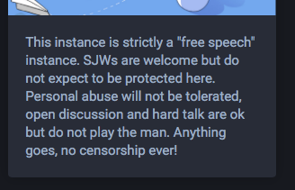
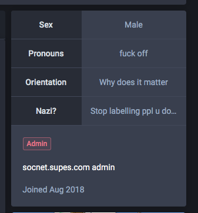
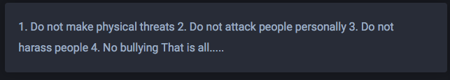

# socnet.supes.com

***last updated 2018.11.05***

The administration of this instance is self-evidently pretty reactionary and displays some sort of bad ignorance and hostility towards queer people.

"SJWs", "free speech", "no censorship", the usual dogwhistles.

(https://socnet.supes.com/@Supes)

The admin displays nice contempt towards pronoun usage and non-binary people ("Pronouns: fuck off"). As well as that whole thing of not understanding the issue queer people face and thus assuming all they want is special treatment instead ("Orientation: Why does it matter").

(The 4th portion says "Nazi?: Stop labelling ppl u don't agree with!!!" 🙄)

The admin also puts 'sex' instead of 'gender' in the first field, which could plausibly indicate they have gender-essentialist views, combined with the rest of this instance and their profile.

---

[The rules of the instance](https://socnet.supes.com/terms) say "Do not attack people personally", "Do not harass people" and "No bullying", but it's self-evidently hypocritical when the admin already displays hostility and contempt for certain groups of people.