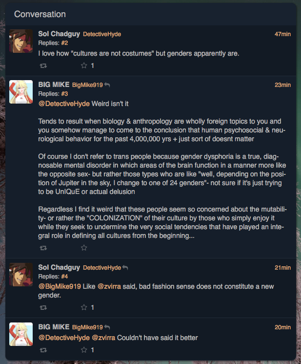
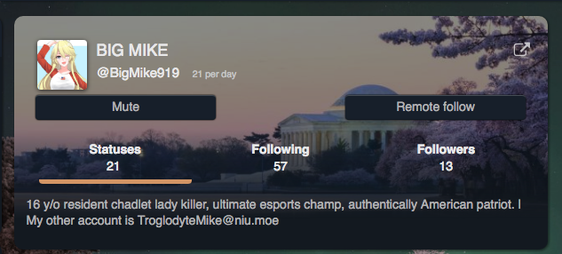
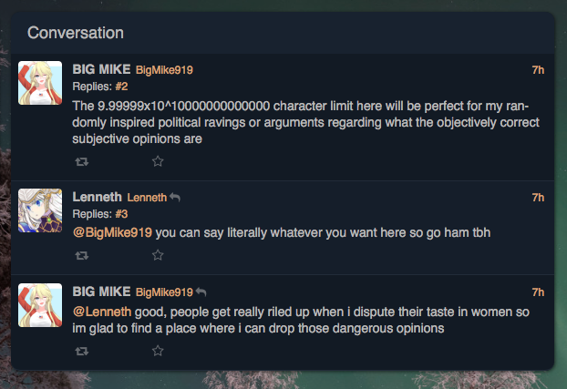
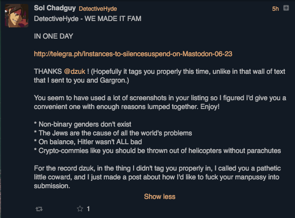

# thechad.zone

***last updated 2019.03.30***

This instance's domain name is named after [popular slang](https://rationalwiki.org/wiki/Manosphere_glossary#Chad) in [Male Supremacy](https://rationalwiki.org/wiki/Manosphere) spaces.

### example 1

Calling being transgender a mental disorder (which is not accurate), and dismissing the existence of non-binary people by calling it 'bad fashion sense'.

There's also a lot of dogwhistling to what they consider to be 'biology & anthropology' with regards to non-binary people (implying that biology and anthropology contradicts their existence (which it doesn't), which is a common thing people who are enbyphobic or otherwise don't think non-binary people should exist for whatever reason attempt to do).

### example 2

(['Chadlet'](https://rationalwiki.org/wiki/Manosphere_glossary#Chad))

### example 3

The person who appears to be the instance administrator (Lenneth) (and is in any case, the only other user on this server (at the time of writing) apart from those in the previous thread) has already signed off on this kind of activity.

### example 4

This was made in reaction to this instance being included on the blocklist, directly addressed to me.

(Also it didn't tag me, because I already blocked your instance. This is why we block. You've made even more of an example of yourself, so thanks for that I guess.)

