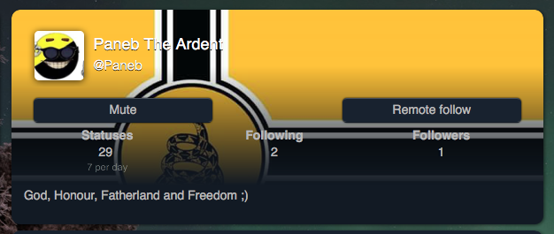
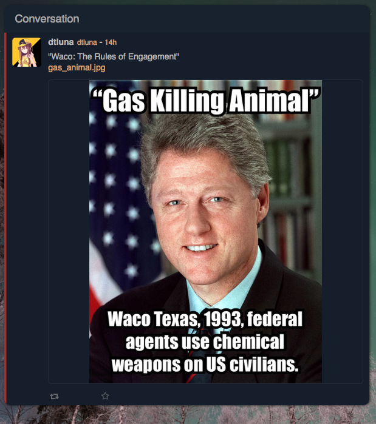

# voluntaryism.club

***Last updated: 2018.06.20***

This instance has been added for alt-right/neo-nazi content and dangerous American militia conspiracy theories.

### example 1

@Paneb's profile.

The background is [one of Nazi Germany's flags](https://en.wikipedia.org/wiki/File:War_Ensign_of_Germany_(1935-1938).svg) crossed with American right-wing libertarian/sovereign citizen imagery. In this context, the 'God' and 'Fatherland' in their bio is likely a massive dogwhistle too.

### example 2

(https://voluntaryism.club/notice/23701)

For context, this is a conspiracy theory regarding the [Waco standoff of 1993](https://en.wikipedia.org/wiki/Waco_siege). Conspiracy theories of this kind about Waco (that it was an intentional mass murder by the US government) have been a big thing among American right-wing militia circles. (These same conspiracy theories also influenced the [Oklahoma City bombing of 1995](https://en.wikipedia.org/wiki/Oklahoma_City_bombing))

This hasn't been the only Waco CT reference this user has posted.