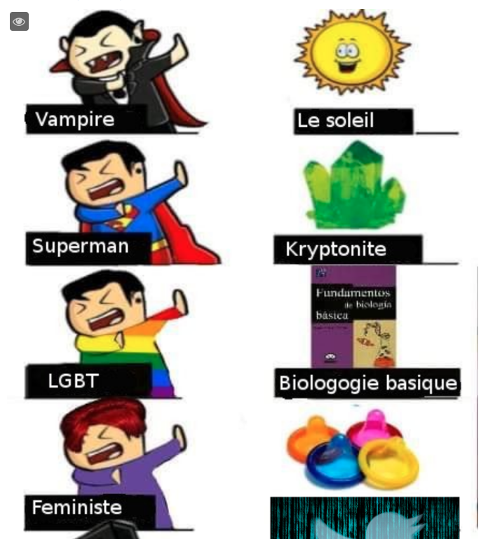
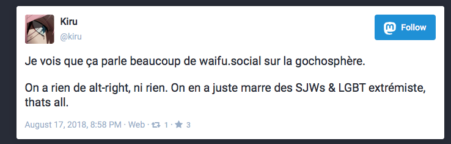

# waifu.social

***Last updated: 2018.08.22***

(yes, that's the instance name, idk what's with these people)

This is a French instance that I was tipped off on. Here are some posts and translations of those posts. My fluent french-speaking sources tell me there's a lot more where this came from, and given what the admin says, it's not hard to imagine.

(https://waifu.social/@ShinikaruZeyd/100567159049366458)

Feminists are paired with condoms (???? i don't even), LGBT is placed next to 'basic biology' (implying the bizarre false idea that somehow the existence of LGBT defies basic human biology, or that LGBT people refuse to accept their idea of what 'basic biology' is).

(https://waifu.social/@kiru/100567345085296947)

From an instance admin: "we're not alt-right, we're just sick of SJWs and LGBT extremists"

And if you look at the pleroma instance they just set up, [it won't take long for you to find that the admin is quite open with the idea of spouting racial slurs](../lolis_world/lolis_world.md).

-----

The admin @kiru made a [pull request](https://github.com/dzuk-mutant/blockchain/pull/16) to this repository soon after the two examples shown here were published, proposing two alterations, one of them being the change from 'we're just sick of SJWs and LGBT' to 'we're just sick of SJWs and LGBT extremists' and the screenshot PR below.

(https://github.com/dzuk-mutant/blockchain/pull/16/commits/0554e349d303da64ea764f909e72d83381441fbe)

The first change fine and what I did, that's a more accurate literal translation so I changed it, but it's not like it changes the implications, especially when you also say 'LGBT don't approve basic biology'.

Neither of these changes actually change the dogwhistles contained, and in fact, this particular suggested change (which doesn't really mean anything against what I said, I just stated what the image pairs were) only reinforces the dogwhistles I was pointing at.

So this idea that I'm misinterpreting them or taking them out of context rings really hollow - the context and meanings were already well established and the admin explicitly reinforced one of them.

