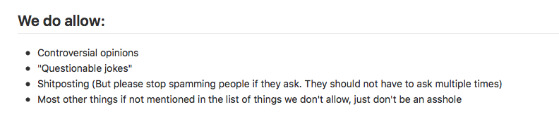
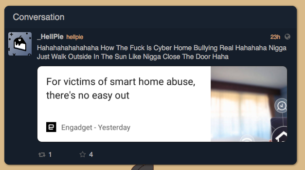
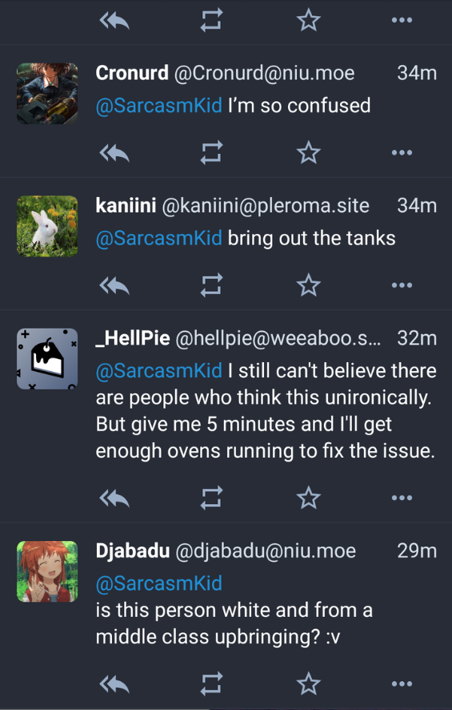
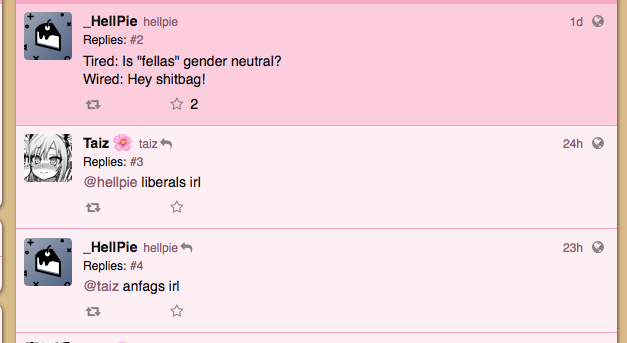
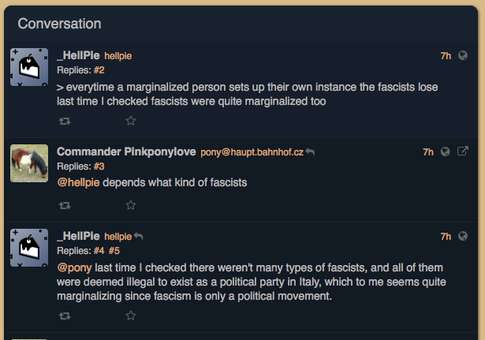
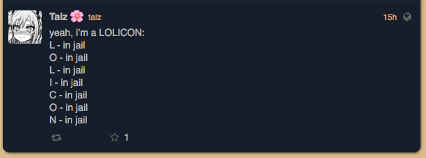

# weeaboo.space

***Last updated: 2018.07.11***

**This instance domain is not a typo. It has 2 'e's.**

This instance contains antisemitic references, hate slurs, lolicon (from user @taiz), lolicon memes and fascist apologism.

The rules confirm that this kind of behaviour is okay in this instance.

### rules snippet

### example 1

(https://weeaboo.space/notice/824345)

### example 2

(Link not acquired, but it comes from a reputable source)

'get enough ovens running'

### example 3

(It's a reply so it didn't have it's own URL)

### example 4

(https://weeaboo.space/notice/831394)

### example 5

(https://weeaboo.space/notice/828664)
