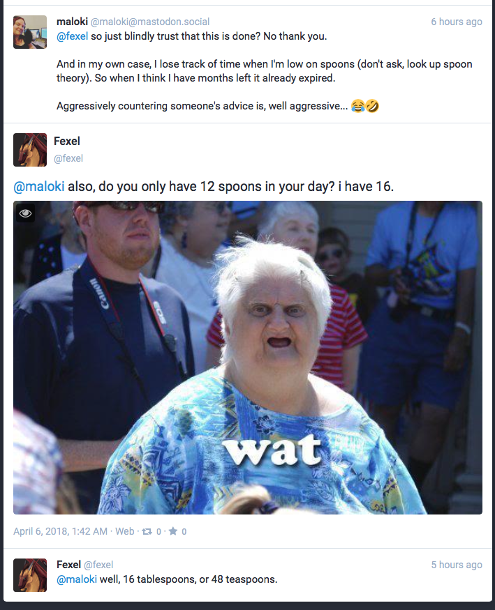
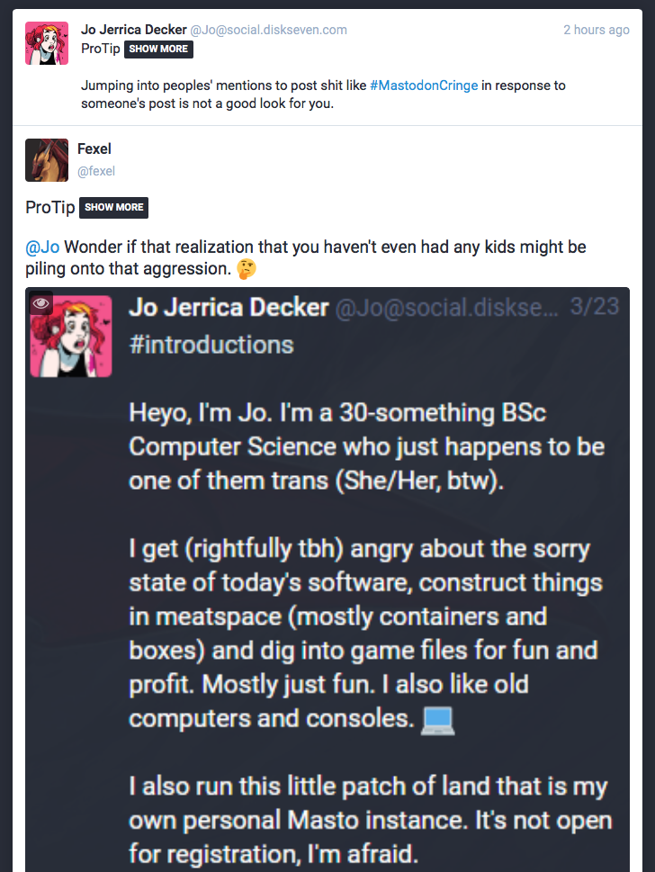
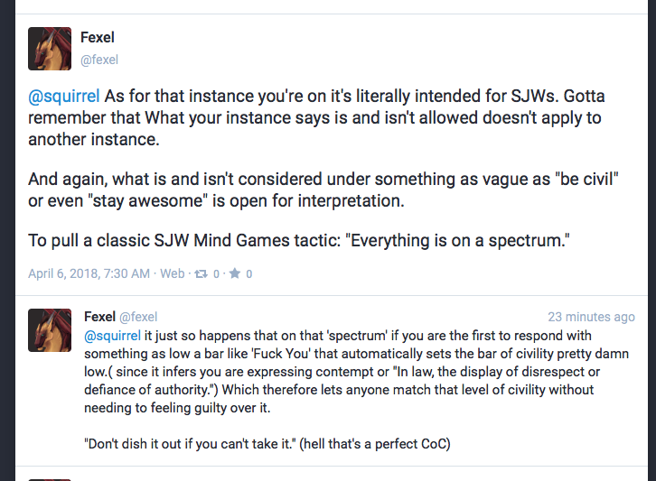

# yiff.rocks

***Last updated 2018.06.13***

**This instance doesn't exist anymore, but is being maintained for future reference.**

The admin is intentionally antagonistic and has bad faith views, acting in an unpleasant way to people, jumping into threads, etc. while doing the usual routine of acting as if they are in good faith and open minded at particular windows of time.

If this is what open minded and rational looks like, I'm kinda confused.

### example 1

Asking 'do you only have 12 spoons in your day?' to try to ridicule what maloki said. (and then continues this on with the tablespoon/teaspoon comments)

(https://yiff.rocks/@fexel/99809713157742244)

### example 2

(https://yiff.rocks/@fexel/99810847759998681)

### example 3

(https://yiff.rocks/@fexel/99810884460863997)

### example 4

(https://yiff.rocks/@fexel/99811079073057262)

