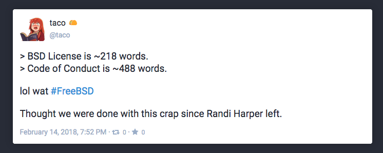
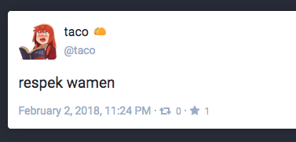

# zerohack.xyz

***last updated 2018.06.16***

On this list for unpleasant edgy stuff and neo-reactionary content.

**This instance has very recently migrated from Mastodon to Pleroma, so the posts and content I am about to talk about and show you are no longer available, but there's no present reason to believe the admin's posting habits have changed.**

When this was on Mastodon, the instance's about page contained phrases like 'laissez-faire approach to moderating this instance as much as possible', 'this is not a 'safe space' and 'I do not care about your feelings'.

While on Mastodon, the admin also posted a GIF containing racist slurs.

(https://zerohack.xyz/@taco/99525457354724038)

This is complaining about FreeBSD's recent code of conduct change which ensures that marginalised groups are safe from harassment and bullshit on official FreeBSD spaces (https://www.freebsd.org/internal/code-of-conduct.html). It's really neat actually.

(https://zerohack.xyz/@taco/99458342374441839)

Anti-feminist dogwhistle.
